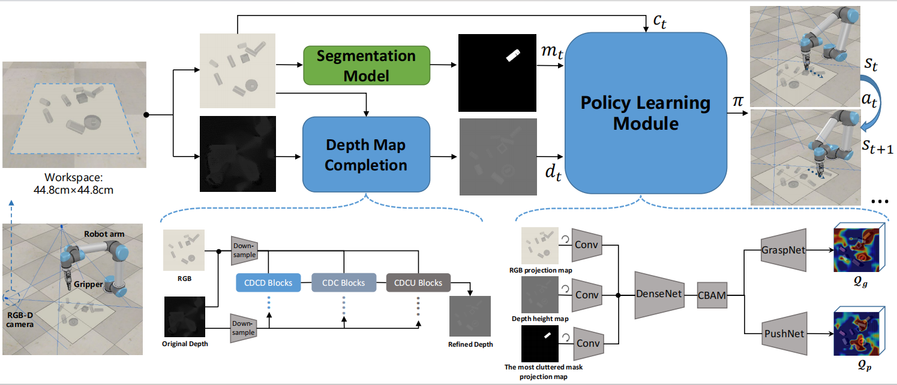

# TCG


<palign="center">
    
    <i>System Overview</i>  
</p>


## Dependencies
```
- Ubuntu 20.04
- Python 3.6
```
The file of the conda environment is environment.yml. We use [V-REP 3.5.0] as the simulation environment.

## Code
We do experiments on a NVIDIA 1080 Ti GPU. It requires at least 8GB of GPU memory to run the code.

To train a regular TCG policy from scratch in simulation, first start the simulation environment by running V-REP (navigate to your V-REP directory and run `./vrep.sh`). From the main menu, select `File` > `Open scene...`, and open the file `simulation/simulation.ttt`. Then navigate to this repository in another terminal window and run the following:

### Training
To train from scratch, run

```
python main.py
```


### Testing
```
python main.py
--is_testing --test_preset_cases --test_target_seeking
--load_ckpt --critic_ckpt CRITIC-MODEL-PATH --coordinator_ckpt COORDINATOR-MODEL-PATH
--config_file TEST-CASE-PATH
```

We use different colors to label the target object in ```simulation/random```.
To design your own challenging test case in ```simulation/preset```.

## Acknowledgments
We reference the following code in our project

- [Visual Pushing and Grasping Toolbox][1]

- [A Deep Learning Method to Grasp the Invisible][2]

- [Light-Weight RefineNet for Real-Time Semantic Segmentation][3]

- [TransCG: A Large-Scale Real-World Dataset for Transparent Object Depth Completion and A Grasping Baseline][4]


[1]: https://github.com/andyzeng/visual-pushing-grasping
[2]: https://github.com/choicelab/grasping-invisible
[3]: https://github.com/DrSleep/light-weight-refinenet
[4]: https://github.com/Galaxies99/TransCG
